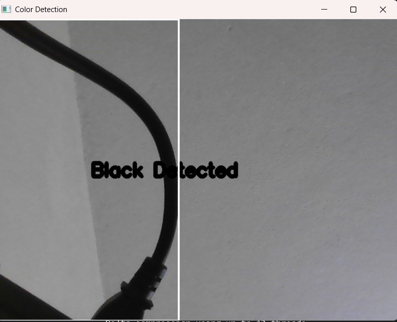
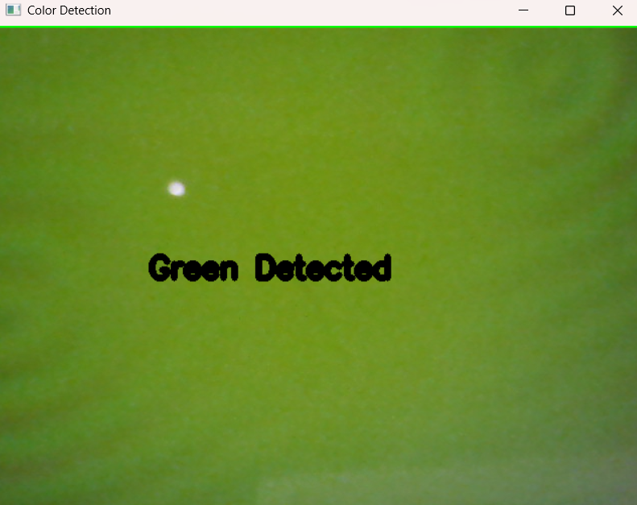

<h1 align="center">
  
  Color Detection
</h1>

<p align="center">
  <b>Real-Time Color Detection using Computer Vision</b>
</p>

<p align="center">
  An end-to-end computer vision application for detecting multiple colors in real-time using a webcam.<br>
  It identifies colors and highlights objects with bounding boxes based on HSV color space.
</p>

<p align="center">
  
  
  
  
  
</p>

---

## 🧠 About the Project

This project uses **HSV color space** to accurately detect colors under different lighting conditions.  
It identifies multiple colors and highlights them visually in real-time.

### 🎯 Supported Colors
- 🔴 Red  
- ⚫ Black  
- 🟡 Yellow  
- 🟢 Green  
- 🔵 Blue  
- 🟠 Orange  
- 🟣 Purple  
- ⚪ White  

---

## 🎥 Project Demo

### ⚫ Black Color Detection
> Detects black objects and displays label with bounding box.



---

### 🟢 Green Color Detection
> Real-time detection of green surfaces using HSV masking.



---

## ✨ Key Features

- 🎥 Real-time webcam input  
- 🎨 Multi-color detection  
- 📦 Bounding box around detected object  
- 🏷️ Dynamic text display  
- ⚡ Noise reduction using thresholding  
- 🧠 Accurate detection using HSV color space  

---

## ⚙️ How It Works

1. Capture video from webcam  
2. Convert frame from **BGR → HSV**  
3. Apply color masks  
4. Detect color using thresholding  
5. Draw:
   - Bounding box  
   - Color label  

---
## 🧠 Models Used

| Model / Technique | Description |
|------------------|------------|
| HSV Color Space | Used to represent colors in a way that is more robust to lighting conditions |
| Color Thresholding | Detects specific colors using predefined HSV ranges |
| Masking | Isolates regions of the image containing the target color |
| Contour Detection | Identifies object boundaries for drawing bounding boxes |

---
## 📂 Project Structure

```bash
Color-Detection-Project/
│── app.py
│── black.png
│── green.png
│── README.md

```

---

## 🛠️ Installation

```bash
git clone https://github.com/kalaigarmukhtarahmed/Color-Detection-Project.git
cd Color-Detection-Project
pip install opencv-python numpy
python app.py

```
---
📊 Workflow
```bash
🎥 Capture video
🎨 Detect color
🧠 Process mask
📦 Draw bounding box
🏷️ Display label
```
---
📈 Results
```bash
✔ Accurate color detection
✔ Real-time performance
✔ Clean UI output
✔ Works under different lighting
```
---
🛠️ Tech Stack
```bash

- 🐍 Python
- 📷 OpenCV
- 🔢 NumPy

```
---
👨‍💻 Author

Kalaigar Mukhtar Ahmed 🎓 Engineering Student | Web Developer | Computer Vision

🏁 Conclusion

This project demonstrates the practical implementation of real-time color detection using computer vision techniques. By leveraging HSV color space, masking, and contour detection, the system accurately identifies and highlights different colors under varying lighting conditions.

The project provides a strong foundation for advanced applications such as object tracking, automation, and AI-based vision systems. It also showcases how efficient image processing techniques can be used without relying on complex machine learning models.

----
